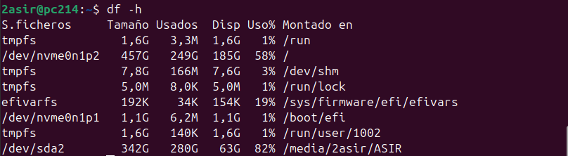
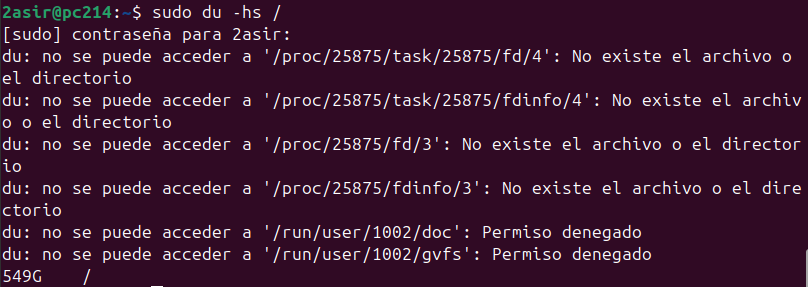

# Comandos Adicionales

Aquí va una pequeña lista de comandos adicionales de monitorización sin ningún orden específico, son variados por lo que los agruparemos en caso de que haya alguno similar a otro.

# DF
El comando df en muestra información sobre el espacio disponible y utilizado en los sistemas de archivos montados, pero como es complejo de entender para humanos 
se suele acompañar de la opción **-h** para que muestre la información con tamaños legibles para los humanos.

# DU
Muestra el tamaño de un directorio (o archivo) a elección, con **-h** muestra el tamaño en lectura sencilla para el humano y con **-s** para que sea información resumida, si es de carpetas, mostrará solo
el tamaño de las carpetas indicidualmente sin los archivos que contenga.

