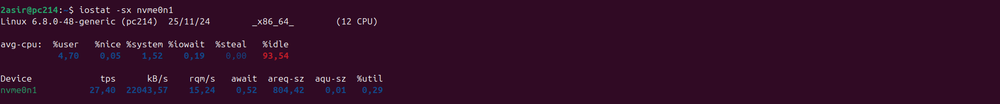

# IOstat

Muestra estadísticas de uso de CPU y dispositivos de almacenamiento como discos duros y particiones. Se utiliza para diagnosticar problemas de rendimiento relacionados con la E/S (Entrada/Salida).

## iostat -m 
Muestra las estadísticas de dispositivos de almacenamiento en megabytes por segundo (MB/s) en lugar de kilobytes por segundo (KB/s), lo que facilita la lectura en sistemas con volúmenes de datos elevados.

##  iostat -x
Muestra estadísticas detalladas de dispositivos de almacenamiento con métricas avanzadas.

## iostat -xs
Combina las estadísticas de uso de CPU y estadísticas detalladas de almacenamiento.

***

[Volver](PS.md)
