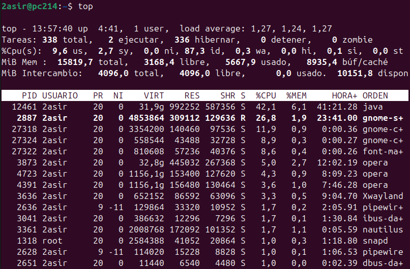
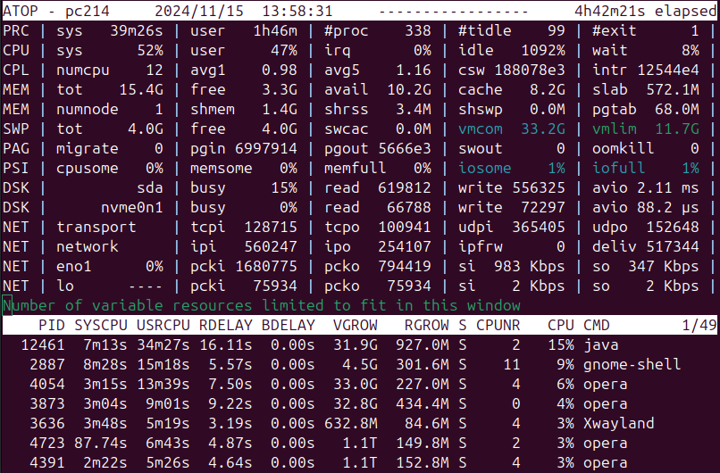

# Top

El Comando **top** muestra en tiempo real los procesos activos en el sistema. Proporciona información sobre el uso de la CPU, memoria, procesos y carga del sistema.

Ordena los procesos según el uso de la CPU por defecto. Se maneja con atajos de teclado para filtrar o cambiar vistas. Es simple y está preinstalado en la mayoría de distribuciones Linux.

## atop
Supervisa el uso de CPU, memoria, disco, red y procesos con historial persistente.

## htop
Una alternativa mejorada y más visual de top. Muestra procesos en una interfaz interactiva y fácil de entender. Interfaz colorida y personalizable, permite navegar por procesos usando teclas de flecha,
facilita la gestión de procesos (como matar procesos) directamente desde la interfaz y muestra métricas gráficas como barras de uso de CPU y memoria

***

[Volver](img/README.md)
